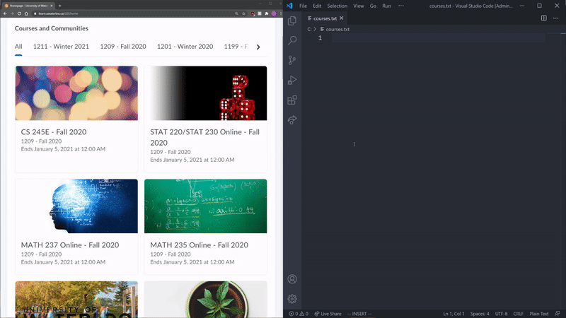

# Coursaver
A python script for downloading all course content from University of Waterloo Learn courses. 

## Installation
Make sure Python3 and Selenium are installed.              

Run coursaver.py with Python3 in a directory with courses.txt which must contain 
links to the homepages of courses you would like to download. 

### MacOS & Linux
Sample usage: 
```Bash
git clone https://github.com/Hozny/CourSaver.git
pip3 install selenium
cd CourSaver
#PASTE LINKS TO THE COURSE HOMPAGES IN courses.txt
python3 coursaver.py
```


